  

# Dunlai ♨️

### 💻 Currently...
-  I’m currently working on **Discord Bot**
-  I’m currently learning **C/C++, Python, Javascript..**
-  I’m looking to collaborate on **web development projects**
-  Ask me about **JavaScript, Discord bots**
-  How to reach me: **hoangtudunlaidangcap@gmail.com**
-  Fun fact: **xD Cat**

###  Connect with me:

---

### 🎧 Discord Presence

---

###  Tech Stack

---

  

  

